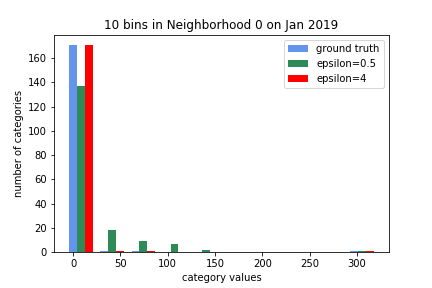

# Confusion Matrix Evaluation Metric

The confusion matrix metric is a version of the pie chart metric provided for the challenge with two added components. The pie chart metric consists of three components: one that evaluates the Jensen-Shannon distance between the privatized and ground truth data, one that penalizes false positives in privatized data, and one that penalizes large total differences between the privatized and ground truth data. The confusion matrix metric adds two elements onto this metric: an element that penalizes for large shifts in values within a record as well as an element that measures the differences in time-series pattern between the ground truth and the privatized dataset. The first element is evaluated through binning values and adding on a penalty if the values change bins after privatization. The second element uses the r-squared value between the two over a chosen time-segment. 

The confusion matrix representation shows the percent of false positives and false negatives in a privatized record. Its purpose is to provide an easy way to view the utility of a particular record or the entire dataset. 

One visualization that may be insightful is the bar chart depicting the component that penalizes for change in rank. This is a way to show how the values are separated into bins and how those bin sizes compare with those of the ground truth dataset. 

